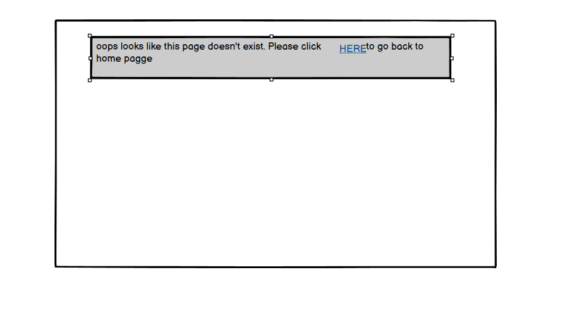
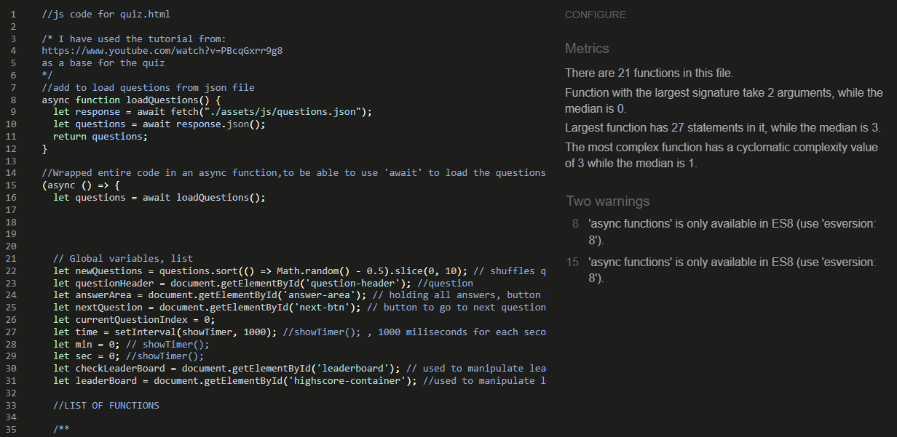

# Qwizard
Qwizard is an online quiz, helping to evaluate your quick, logical thinking and reading/listening skills. Do you ever feel like you're listening to someone but not really hearing the context? This quick, 10 questions quiz will help you understand if you let your mind wonder about or actually process the words and focus on the meaning. 
Even though the quiz has some tricky questions, they are all simple and don't require any special knowledge, so it is aimed towards anyone who can read. It's meant to be fun, not difficult and the colour pallete will surely let you know of that as soon as you see it!

## FEATURES
### Main header
* This is shown the same on every page for consistent design, once quiz starts,mthe header includes a link which user can use if they want to be taken back to home page/ instructions page.
* When hovered over, the header will change the colour, so that the user is aware of the link. Simple, not busy design, allows the user to easily navigate back to the beggining.

### Home page
* The home page includes two features below the header.
#### Instructions 
* These are the main feature, quick description of what is the aim of the quiz and general info (ie. number of questions within the quiz) followed by simple list of steps and what happens if you follow them ( username -> start -> timer). The aim of this section is to let the user know what to expect.

#### Username input
* Previous instructions advise the user of having to type username. User has to input username if not entered, and user clicks 'submit'an alert will be displayed.
  The aim of this is to be able to display personalised welcome message and then view the score within leaderboard/if applies.
* If user adds the username, they will be taken to a personalised welcome message and an option to click 'START' when ready to start answering questions

### Quiz page
* Once user clicks the start button below previously seen welcome message, they will be taken to a quiz page.  Five features have been implemented here:
#### Timer
* Displayed at the top left close to the header. The aim of this feature is for the user to be able to track the time taken to answer the questions. This will not be shown in leaderboard but as the aim of the quiz is to answer the 10 questions correctly as quick as possible, each user can see the progress for themselves and see the total time taken to complete quiz in final score message.

#### Question displayed
* The top of the page will display the question number followed by the question
* The aim of displaying the number is so that the user can see how many questions they have answered. And as we previously made the user aware of the total number of questions, they can easily figure out how many questions is left.
* The questions will be displayed randomly and each time the user takes the quiz they will receive a different set of questions, the aim of this is to not bore the user with the same set of questions over and over again.

#### Answers displayed
* Each question will be assigned with 3 different answers. User can only pick one of them and once selected, all other options will be disabled. Each selected, correct answer will be highlighted with a greenish/turquoise colour, matching the background colours. Each incorrectly selected answer will be highlighted with reddish/burnt orange colour matching the colours from the background too, for consistent design.

#### Next button
* The next button will only display once one answer has been selected, the aim of this is so that the user can't skip a question and to not have to display an alert to make them aware of having to pick at least one option, if the button was displayed.

#### Incremented score count display
* This feature is displayed below the next button. The aim of this is so that a user can keep track of the progress throughout the game.

### Footer
* Each page has a footer below the main game content, the footer displays icon links to Github and Linkedin accounts
* As the website is educational, the aim of these is so that a user can see my Github work and the Linkedin account if they wish to know more about me

### 404 ERROR PAGE NOT FOUND
* This page will show for a user if wrong link for the page is entered. 
* The benefit of the page is that customer get's clear message with a link to go back to home page so that they can start from begging. User won't have to use browsers back button.

### Features left to implement
* In the future I would like to create an option for the user to create an account and store the progress
* For the user to be able to pick different categories of the questions for example test maths skills, history knowledge or foreign language skills
* For the user to be able to compete against another players

## DESIGN
* small to large screen wireframe ( quiz will look the same across all screen sizes. There will be slight difference in displaying incremented score count but still can be found under the answers)
* Please note the footer has been added to each page right below the largest div, footer includes two icon links (github and linkedin)
     * Home page
             
     * this will be amended to welcome message with JS once user clicks 'submit' button
             
     * Quiz page
             
     * this will be amended to display total score and leaderboard with JS once user answers last question and clicks next
             
     * 404 page 
             

## TESTING

### Responsiveness
Website has been checked for responsiveness through Development tools. In order to do this, the following steps have been taken:
1. Open browser
2. Navigate to Qwizard at https://asiawi.github.io/Qwizard/
3. Right click anywhere on the page and go to "Inspect" to open Development Tools
4. Click on drop down menu: "Dimensions: Responsive" and choose "Responsive"
5. Drag the side of the screen and change screen size, make sure the website looks good from 320px and up. Make sure no side 
   scroll bar is showing.

* Expected- page is user friendly when viewing the website on small and large screens.
* Actual- website looks good, no bottom scroll bar showing, all content clearly visible. Website is user friendly on all screen sizes.

* The following devices have been used to check responsiveness:
    * Iphone 13 Pro
    * Google Pixel 7 Pro 
    * Surface Pro
    * Asus Vivobook

### Accessibility
Each page checked with the help of WAVE Accessibility tool (https://wave.webaim.org/). Each page passes accesibility test with no error for:
* contrast
* aria- labels for users who use screen-readers
* alternative text as a function for screen readers or in events when images don't load
* structural elements - for users of assistive technology as well as visual and semantic meaning
* language of the document- for screen readers

### Manual Testing
Manual testing performed, to ensure website performs well on different browsers and devices.
* Browsers
    * Chrome
    * Safari
    * Microsoft Edge
    * Firefox

        * Issue: Text inside buttons and form input shown with no styling when viewed on Safari.
        * Fix: I have styled the text so that it looks the same when viewed in Safari as it does on other browsers. 
* Devices
    * Iphone 13 Pro
    * Motorola Edge 20
    * Surface Pro
    * Asus Vivobook
    * Samsung Galaxy A12 
    * Iphone 14 

         * Issue: Questions don't show after moving the quiz questions into json file- when viewed on Iphone/Safari
         * Fix: I have changed the method and instead of importing the file I have used 'fetch' and wrapped my code inside async function, this worked and questions now display fine.

### Lighthouse
* HOME PAGE (desktop & mobile)

* QUIZ PAGE (desktop & mobile)

### Functional Testing

* Buttons and anchor links
    * All checked and work as expected

|Button/ anchor link (location)                        | DESTINATION PAGE                                   | PAGE OPENS IN NEW TAB       |
|------------------------------------------------------|----------------------------------------------------|-----------------------------|
|'Submit'(home page/below username input)              | index.html/welcome msg                             | no- as expected             |
|'START'(home page/displayed after clicking submit)    | quiz.html/1st question displayed                   | no- as expected             |
|'Next' (displayed once answer is selected)            | quiz.html/next question selected                   | no- as expected             |
|'Try again'(quiz.html/displayed below final score)    | quiz.html/1st question displayed                   | no- as expected             |
|'leaderboard'(quiz.html/displayed below final score)  | quiz.html/leaderboard list displayed               | no- as expected             |
|Quiz page link (within header)                        | index.html                                         | no- as expected             |
|'Github' icon(footer)                                 | https://github.com/AsiaWi                          | yes- as expected            |
|'Linkedin' icon(footer)                               | https://www.linkedin.com/in/joanna-witek-51017b263/| yes- as expected            |

* Functionality testing

|   function/location          |            action                              |   expected                                                   |   actual                    |
|------------------------------|------------------------------------------------|--------------------------------------------------------------|-----------------------------|
|username input/ index.html    |user enters their name and clicks submit        | welcome message displays and an option to click 'start'      | as expected                 |
|                              |                                                |                                                              |                             |
|                              |user doesn't enter their name and clicks submit | alert displayed indicating to enter username                 | as expected                 |
|                              |                                                |                                                              |                             |
|start button/index.html       |user clicks start                               | user taken to a quiz.html page, quiz starts, timer starts    | as expected                 |
|                              |                                                |                                                              |                             |
|                              |                                                |                                                              |                             |
|answer buttons/quiz.html      |user selected correct answer                    | button highlighted turquoise colour, other answer buttons    |                             |
|                              |                                                |disabled, next button displayed,correct score incremented by 1| as expected                 |
|                              |user selected incorrect answer                  |button highlighted burnt orange colour, correct answer shown  |                             |  
|                              |                                                |in turquoise, all answer buttons disabled, next button        |                             |
|                              |                                                |displayed, incorrect score incremented by 1                   | as expected                 |
|next button/quiz.html         |user clicks next button                         |next question displayed, question number incremented by one   | as expected                 |
|                              |user clicks next after answering question 10    |total score displayed (username and scores shown),            |                             |
|                              |                                                |leaderboard and try again buttons shown                       | as expected                 |
|                              |                                                |                                                              |                             |
|leaderboard button/quiz.html  |user clicks the button once                     |top 5 scores shown as leaderboard, try again option still     |                             |
|                              |                                                |available for user if they want to play again                 | as expected                 |
|                              |user clicks the button 2nd time                 |leaderboard collapses, only leaderboard button shown,         |                             |
|                              |                                                |try again button shown below                                  | as expected                 |
|                              |                                                |                                                              |                             |
|try again button/quiz.html    |user clicks the button                          |quiz starts again, question no.1 displayed                    |                             |
|                              |                                                |timer starts from 0                                           | as expected                 |

### Validator testing
* HTML
 No errors were found when passing through the official WSC Validator
 
* CSS
No errors were found when passing through the official Jigsaw W3 Validator

* JAVA SCRIPT
No errors were found when passing through the jshint validator. (https://jshint.com/)
  * script.js validated:

  * username.js validated:

## Version Control
The website was developed through Visual Studio Editor 

Code has been pushed with git commands to remote repository on Github with commands:
* git add . - to add files ready to commit
* git commit -m "message" - to commit the code to local repository ready to be pushed
* git push - final command used to push commited code to remote repo on Github

## CLONING THE REPOSITORY

1. On Github navigate to repository
2. Click "Code" a green button shown right above the file list
3. Copy the URL of the repo using HTTPS, SSH OR Github CLI
4. Open Git Bash
5. Change the current working directory to the location where you want the cloned directory
6. Type git clone, and then paste the URL you copied earlier
7. Press enter to create local Clone

For more details on how to clone the remote repo in order to create a local copy for own use, please go to 
https://docs.github.com/en/repositories/creating-and-managing-repositories/cloning-a-repository

## FORKING
1. On Github navigate to repository
2. click "Fork" located towards the top right corner
3. Select "owner" for the forked repo, from the dropdown menu under "owner" Under "Owner"
4. It will create forked repo under the same name as orinial by default but you can type a name in "Repository name" or add a description in "Description" box.
5. Click "Create fork" !

Forking allows you to make any changes without affecting original project. You can send the suggestions over by submitting pull request. Project owner can review the pull request before accepting the suggestions and merging them.

For more details on how to fork the repo, in order to for example suggest any changes to the project you can visit: 
https://docs.github.com/en/get-started/quickstart/fork-a-repo

When you have fork to a repository you don't have access to files locally on your device, for this you will need to clone the forked repo.

## DEPLOYMENT
The site was deployed to GitHub Pages.
1. Go to Github repo
2. Click on "Settings"
3. Click on "Pages"(tab on the left sidebar)
4. scroll to "Build and deployment"/"Source" section
5. Find sub-section "Branch"
6. From drop-down manu "none"/"select branch" choose source "main" (or "master")
7. Click "Save"
8. Wait until you can see a link for deployed page within Github Page section, this can take a while
   and once the page updates you will see a message:
  * Your site is live at https://asiawi.github.io/Qwizard/

## TECHNOLOGIES
* Balsamiq- used to create wireframes
* Favicon.io - used to create favicon for the page
* Visual Studio Code - used to develop the website
* Github - used to host source code and deploy on Github Pages
* Git- used to commit and push code 
* HTML - used to create main content of the website
* CSS- used for website styling
* JavaScript- used to create dynamic content and make page interactive
* Tiny PNG- used to compress the size of background
* WEBP CONVERTER -used to convert background image, https://cloudconvert.com/webp-converter
* Wave Evaluation Tool- used for checking accessibility
* Techsini.com- used for creating mockup image
* W3C Validator- used for checking HTML and CSS for errors
* jshint validator - used to check java script code for errors

## CREDITS
* base of the quiz taken from the tutorial: https://www.youtube.com/watch?v=PBcqGxrr9g8
* idea of how the quiz would look like taken from https://github.com/Mrst12/Quizzical
* google fonts
* background Image by Freepik:
    <a href="https://www.freepik.com/free-vector/hand-drawn-abstract-doodle-pattern_22339896.htm#query=background%20doodle&position=25&from_view=search&track=ais">Freepik</a>
* questions taken from: 
    https://www.scienceofpeople.com/trick-questions/  and  https://www.brightful.me/blog/trick-questions/
* js code for timer, help from:  
    https://stackoverflow.com/questions/44314897/javascript-timer-for-a-quiz 
* js code to pick random questions, help from: 
    https://stackoverflow.com/questions/2450954/how-to-randomize-shuffle-a-javascript-array
* js code to create username, help from: 
    https://stackoverflow.com/questions/58750774/ask-user-enter-name-with-javascript-and-html
* js code for leaderboard, I have used:
    https://michael-karen.medium.com/how-to-save-high-scores-in-local-storage-7860baca9d68
    https://www.youtube.com/watch?v=o3MF_JmQxYg&list=PLB6wlEeCDJ5Yyh6P2N6Q_9JijB6v4UejF&index=7  (videos 7,8,9)
* Love Maths project from CI- general help and increment score code
* Readme structure from my last project: https://github.com/AsiaWi/hygge_life